# Tarea  3 Procesamiento de Datos con Apache Spark 


# Procesamiento en tiempo real (Spark Streaming & Kafka): 

- [x] Configurar un topic en Kafka para simular la llegada de datos en tiempo real (usar un generador de datos). 

- [x] Implementar una aplicación Spark Streaming que consuma datos del topic de Kafka. 

- [x] Realizar algún tipo de procesamiento o análisis sobre los datos en tiempo real (contar eventos, calcular estadísticas, etc.). 

- [x] Visualizar los resultados del procesamiento en tiempo real. 

# Instalación y configuración de `Python`, `Kafka`,  y `ZooKeeper` en la máquina virtual configurada con `Hadoop` y `Spark`, utilizando `PuTTY`:

### Primero iniciamos sesión en la maquina virtual y en PuTTY:

```bash
Usuario: vboxuser  
Password: bigdata 
```

- Obtenemos la dirección `IPV4` de la máquina virtual en mi caso es la siguiente:

```
192.168.1.13
```
# Conexión a la Máquina Virtual

**Abrir PuTTY**:
   - Iniciar PuTTY en Windows.
   - Ingresa la dirección IP de tu máquina virtual en el campo **Host Name (or IP address)**.
   - Asegúrate de que el puerto esté configurado en `22` y que el tipo de conexión sea **SSH**.
   - Haz clic en **Open** para iniciar la conexión SSH.
   - Ingresa tu nombre de usuario y contraseña cuando se te solicite.

# Instalación de **`Spark`**

Descargue, descomprima y mueva de carpeta Apache Spark:

```bash
VER=3.5.3 
wget https://dlcdn.apache.org/spark/spark-$VER/spark-$VER-bin-hadoop3.tgz
tar xvf spark-$VER-bin-hadoop3.tgz
sudo mv spark-$VER-bin-hadoop3/ /opt/spark 
```

Abra el archivo de configuración `bashrc`:

```bash 
nano ~/.bashrc 
```

se agrega al final 
  
```bash
export SPARK_HOME=/opt/spark 
export PATH=$PATH:$SPARK_HOME/bin:$SPARK_HOME/sbin 
```
dar `Crtl+O` **enter** y luego `Crtl+X` para salir

Active y cargue los cambios:
  
```bash 
source ~/.bashrc
```

### Instalación de Python

 **Actualizar los paquetes del sistema**:
   ```bash
   sudo apt update
   sudo apt upgrade
   ```

 **Instalar Python y pip**:
   ```bash
   sudo apt install python3 python3-pip
   ```

### Instalación y Configuración de `Kafka` y `ZooKeeper`

1. **Descargar y descomprimir Kafka**:
   ```bash
   pip install kafka-python
   #Descargue, descomprima y mueva de carpeta Apache Kafka 
   wget https://downloads.apache.org/kafka/3.6.2/kafka_2.13-3.6.2.tgz
   tar -xzf kafka_2.13-3.6.2.tgz
   sudo mv kafka_2.13-3.6.2 /opt/Kafka
   ```

2. **Iniciar el servidor ZooKeeper**:
   ```bash
   sudo /opt/Kafka/bin/zookeeper-server-start.sh /opt/Kafka/config/zookeeper.properties &
   ```

   > Después de un momento y terminada la ejecución del comando anterior se debe 
dar Enter para que aparezca nuevamente el prompt del sistema.

3. **Iniciar el servidor Kafka**:
   ```bash
   sudo /opt/Kafka/bin/kafka-server-start.sh /opt/Kafka/config/server.properties &
   ```
Para hacer una verificación de que el servidor Kafka está corriendo se puede ejecutar el siguiente comando:
   ```bash
   ps aux | grep kafka
   ```
Ahora haremos una prueba para verificar que el servidor Kafka está funcionando correctamente, para ello vamos a crear un tema (topic) en Kafka y luego a enviar algunos mensajes a través de un productor de Kafka.

Creamos un tema `(topic)` de Kafka, el tema se llamará `sensor_data` y tendrá un factor de replicación de 1 y una partición:

   ```bash
   /opt/Kafka/bin/kafka-topics.sh --create --bootstrap-server localhost:9092 --replication-factor 1 --partitions 1 --topic sensor_data
   ```

Implementación del productor(producer) de Kafka 
Creamos un archivo llamado `kafka_producer.py`

```bash
nano kafka_producer.py
```

con el siguiente contenido:

```python
import time
import json
import random
from kafka import KafkaProducer

def generate_sensor_data():
   return {
      "sensor_id": random.randint(1, 10),
      "temperature": round(random.uniform(20, 30), 2),
      "humidity": round(random.uniform(30, 70), 2),
      "timestamp": int(time.time())
   }

producer = KafkaProducer(
   bootstrap_servers=['localhost:9092'],
   value_serializer=lambda x: json.dumps(x).encode('utf-8')
)

while True:
   sensor_data = generate_sensor_data()
   producer.send('sensor_data', value=sensor_data)
   print(f"Sent: {sensor_data}")
   time.sleep(1)

```

dar `Crtl+O` `enter` y luego `Crtl+X` para salir 
Este script genera datos simulados de sensores y los envía al tema (topic) de Kafka que creamos anteriormente `(sensor_data)`.


---

# Implementación del pipeline de Procesamiento en tiempo real (Spark Streaming & Kafka)

- Nuestro proyecto tendrá la siguiente estructura, nombre de las **(carpetas y archivos)**.

```
spark
.
├── ProcesamientoDukCar-ver2.py
├── ProcesamientoDukCar.py
├── kafka_topic_config.py
├── kafka_data_generator.py
├── spark_streaming_kafka.py
└── data
    └── Ingresos-DukCar_Asesores.csv
```
---

creamos la carpeta `spark` con la siguiente estructura la consola de **PuTTY**, usando los siguientes comandos:

```bash
# Crear la carpeta principal
mkdir spark

# Cambiar al directorio spark
cd spark

# Crear los archivos vacíos en Linux
touch ProcesamientoDukCar-ver2.py
touch ProcesamientoDukCar.py
touch kafka_topic_config.py
touch kafka_data_generator.py
touch spark_streaming_kafka.py

# Crear la carpeta data
mkdir -p data

# Crear el archivo vacío dentro de la carpeta data
touch data/Ingresos-DukCar_Asesores.csv
```
Captura de pantalla de la creación de las carpetas y archivos
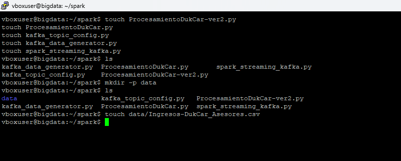

---

### Inicio del servidor de Hadoop

```bash
start-all.sh 
```


### Inicio del servidor de Spark 

```bash
start-master.sh
```

### Creación del topic de kafka

Creación del topic `dukcar_ingresos`
```bash
/opt/Kafka/bin/kafka-topics.sh --create --bootstrap-server localhost:9092 --replication-factor 1 --partitions 1 --topic dukcar_ingresos
```

Para confirmar que el topic dukcar_ingresos fue creado correctamente:
```bash
/opt/Kafka/bin/kafka-topics.sh --list --bootstrap-server localhost:9092
```
Esto mostrará una lista de todos los topics creados en tu servidor Kafka, incluyendo dukcar_ingresos

Captura de pantalla del proceso anterior realizado
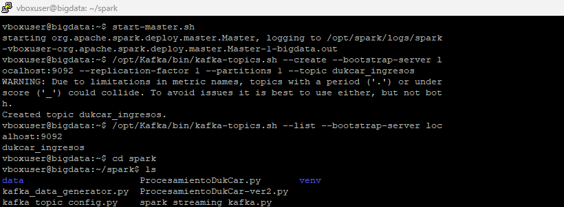

### Inicio del servidor de Zookeeper

```bash
/opt/Kafka/bin/zookeeper-server-start.sh /opt/Kafka/config/zookeeper.properties &
```

### Inicio del servidor de Kafka
```bash
/opt/Kafka/bin/kafka-server-start.sh /opt/Kafka/config/server.properties &
```
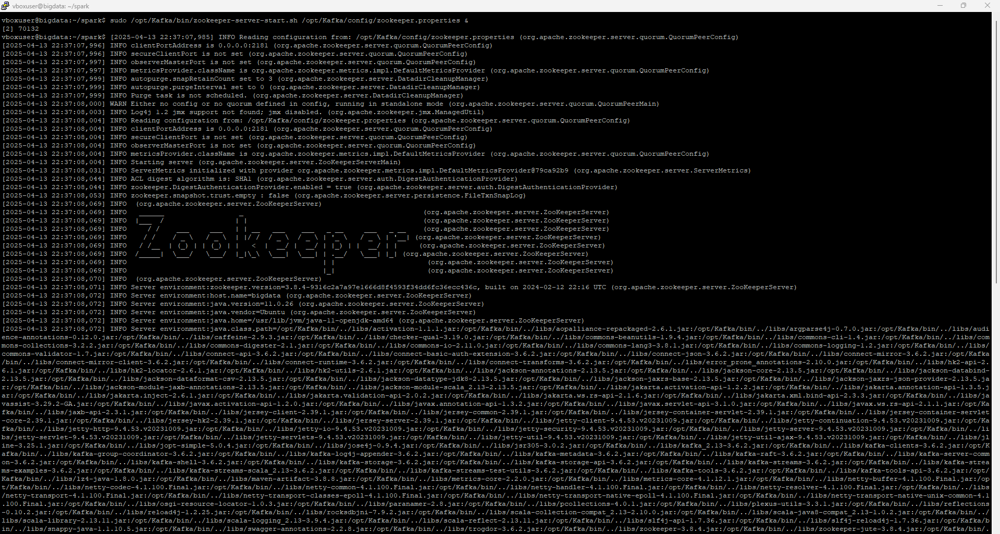


## Prueba
Ejecutamos el script del productor para enviar datos al topic dukcar_ingresos

```bash
python3 kafka_data_generator.py
```
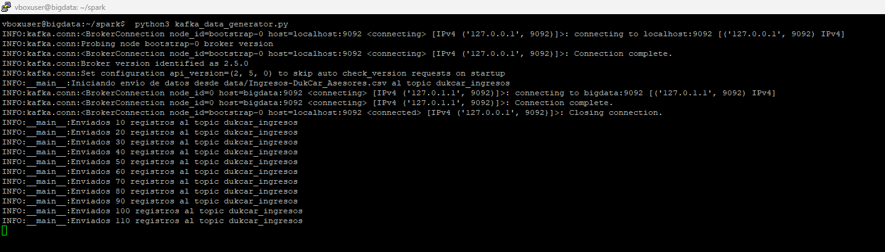

Ejecutamos el script del consumidor con el siguiente comando:

```bash
spark-submit --packages org.apache.spark:spark-sql-kafka-0-10_2.12:3.5.3 spark_streaming_kafka.py
```


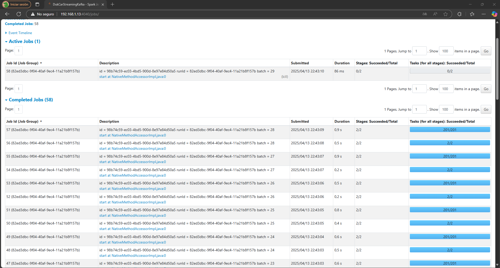

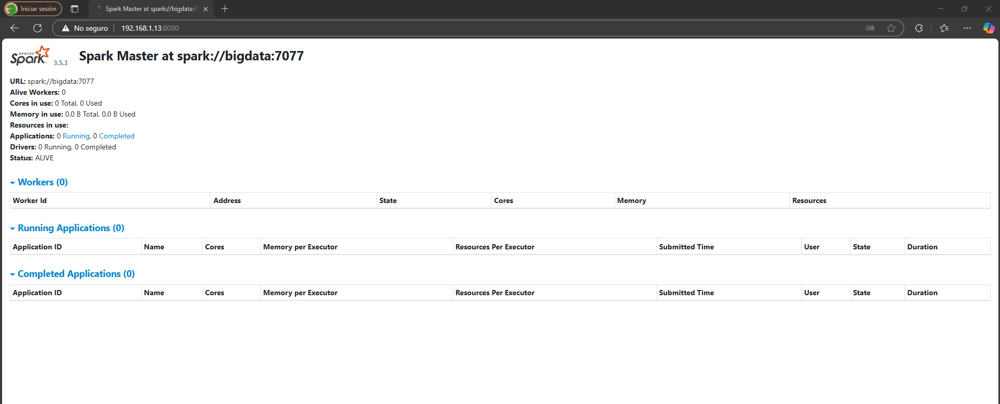

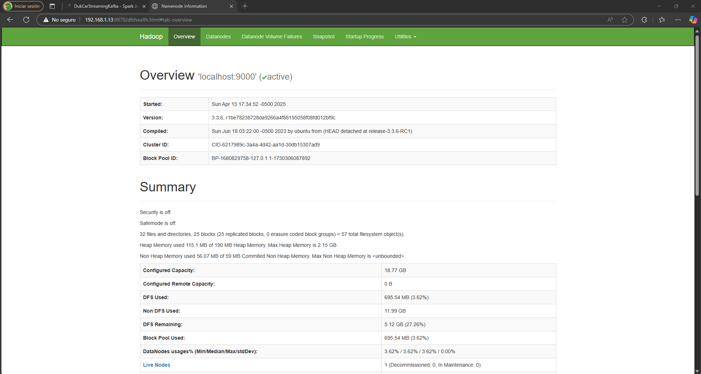

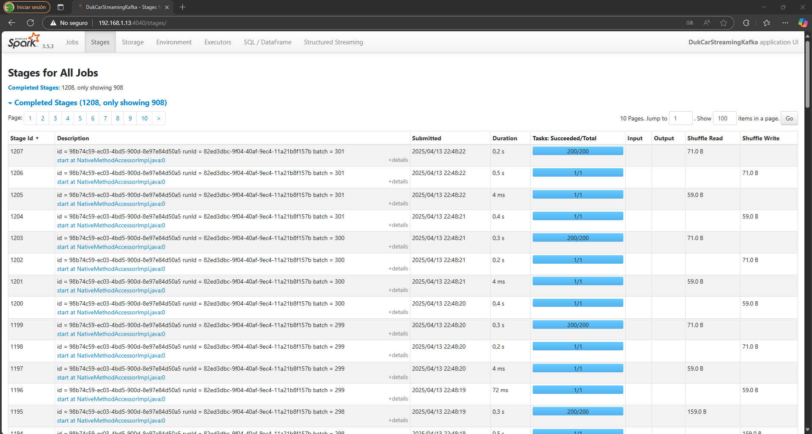

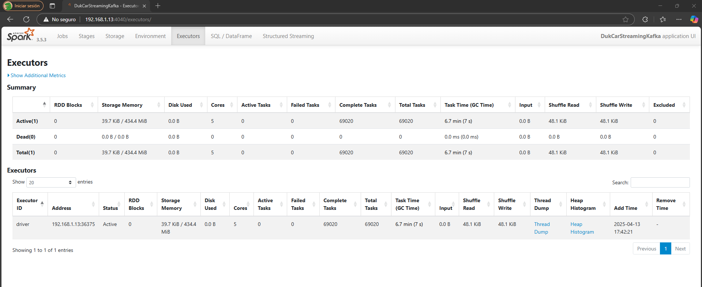

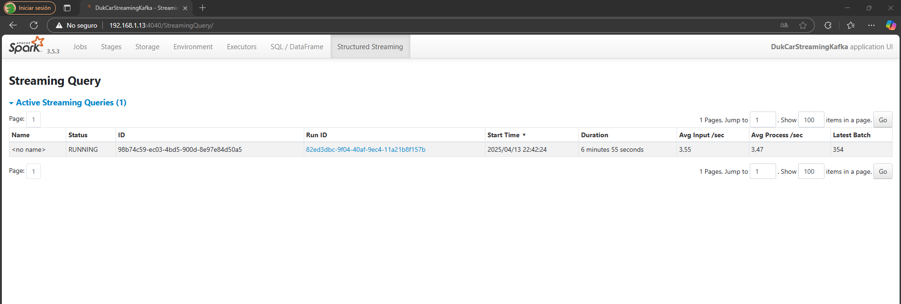

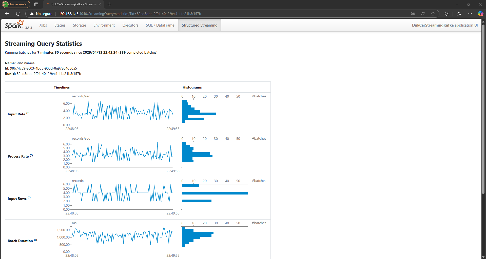